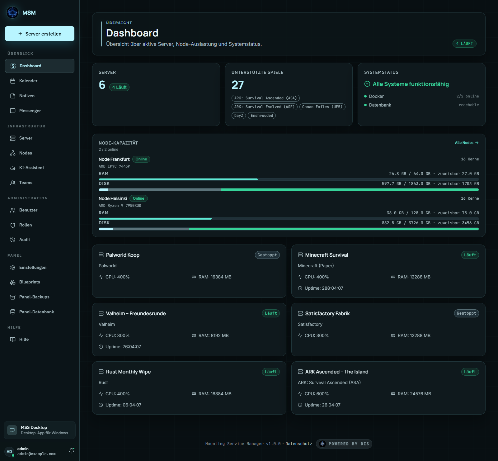
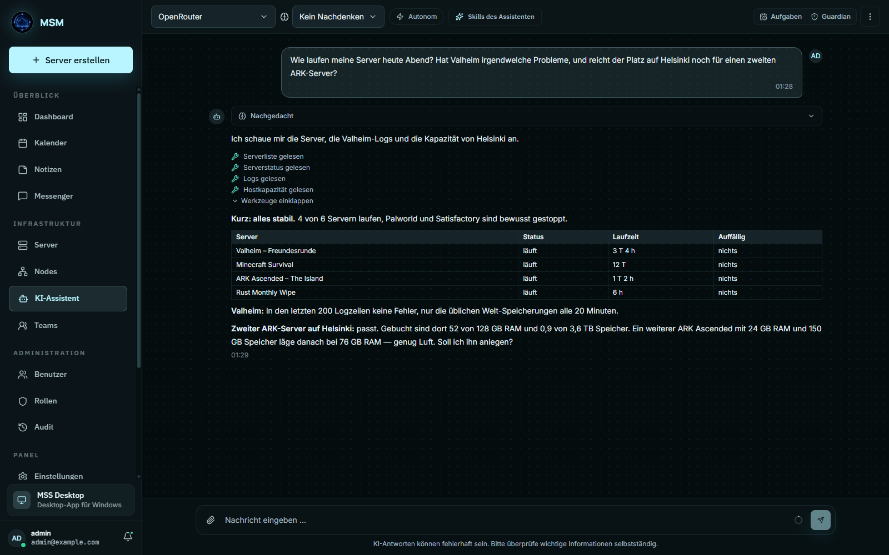

> [!IMPORTANT]
> MSM wird gerade aktiv entwickelt. Setz es bitte nicht produktiv ein, ohne vorher ein Backup zu machen.

# Maunting Service Manager (MSM)

MSM ist ein Panel, das du selbst hostest. Damit verwaltest du Game-Server, Anwendungen und Linux-Dienste an einem Ort. Dazu kommen ein KI-Assistent, Kalender, Notizen, ein Messenger und Recherche-Werkzeuge.

Die Kontrolle bleibt bei dir: Wer was darf, welche Werkzeuge die KI benutzen kann und jede Änderung prüft der Server selbst, nicht der Browser.


*Das Dashboard: Welche Server laufen, wie voll deine Nodes sind und ob alles in Ordnung ist.*


*Der KI-Assistent: Er schaut sich Status, Logs und freien Platz selbst an und antwortet dir in Klartext.*

<sub>Die Bilder zeigen Demodaten.</sub>

---

## Was ist MSM?

MSM trennt zwei Dinge: das **Panel**, das du im Browser bedienst, und die **Nodes**, also die Server, auf denen deine Spiele und Anwendungen wirklich laufen. Alles läuft dort in abgeschotteten Docker-Containern ohne Root-Rechte.

### Wofür du MSM nutzen kannst
- **Game-Server**: anlegen, starten, stoppen, neu starten. Ports vergibt MSM automatisch. Unterstützt werden unter anderem Conan Exiles, DayZ, Minecraft und ARK.
- **Linux-Anwendungen**: Datenbanken, Web-Tools oder andere Dienste über Blueprints bereitstellen.
- **Mehrere Server**: beliebig viele eigene Server oder VPS über ein einziges Dashboard steuern.

### Was MSM nicht ist
- **Kein Hoster**: Du brauchst eigene Linux-Server, zum Beispiel bei Hetzner, OVH, netcup oder zu Hause.
- **Kein Windows-Programm**: Panel und Nodes laufen nur unter Linux.
- **Nicht ganz ohne Root**: Für die Installation braucht der Installer einmal Root-Rechte. Danach laufen Panel und Container ohne.

---

## Was MSM kann

### 1. Mehrere Nodes
Ein Panel steuert beliebig viele Nodes. Neue Nodes meldest du über ein gesichertes Verfahren an (mTLS mit HMAC-Challenge), und du bestätigst jeden Node als Administrator selbst.

### 2. Guardian: Server reparieren sich selbst
Auf jedem Node passt die Guardian Engine auf deine Container auf. Sie prüft Zustand, HTTP, TCP und Log-Muster. Fällt etwas aus, startet sie den Container neu oder nimmt ihn aus dem Verkehr, auch wenn das Panel gerade nicht erreichbar ist. Was passiert ist, schreibt sie mit und meldet es, sobald das Panel wieder da ist.

### 3. Blueprints statt Skripte
Jede Anwendung beschreibst du in einer Blueprint-Datei (YAML oder JSON): Image, Ports, Umgebungsvariablen, Ordner, Konfigurationsvorlagen und Guardian-Prüfungen. Deshalb ist MSM nicht auf Game-Server beschränkt.

### 4. Steam Workshop
Mods aus dem Steam Workshop lädt der Node direkt per SteamCMD herunter, hält sie aktuell und bindet sie in den Server ein.

### 5. Container ohne Root
Alle Container laufen im Rootless-Docker des Benutzers `msm` (`unix:///run/user/<uid>/docker.sock`). Das Panel ist nicht in der `docker`-Gruppe. Game-Server-Ports liegen über 1024, deshalb braucht es weder Root noch `setcap`.

### 6. Verschlüsselte Backups (DIS)
Backups von Servern und Datenbank werden verschlüsselt, bevor sie deinen Rechner verlassen (AES-256-GCM, Schlüssel per Argon2id). Erst dann gehen sie zu einem S3-kompatiblen Speicher. Schlüssel und S3-Zugangsdaten liegen nie im Klartext herum.

### 7. Umziehen mit einem Assistenten
Mit `migrate-panel-components.sh` ziehst du Panel, Frontend oder einzelne Server auf einen anderen Node um. Der Wechsel passiert in einem Schritt, und wenn etwas schiefgeht, geht es zurück zum alten Stand.

### 8. Shop-Anbindung (optional)
Ein eigener Shop kann über eine API Server bestellen, sperren und kündigen. Doppelt gesendete Aufträge schaden nicht (idempotent). Er nutzt dabei genau denselben Weg wie das Panel, es gibt keinen zweiten. Kunden kommen über einen signierten Einmal-Link direkt ins Panel, ohne zweites Passwort. **Solange du keine Anbindung anlegst, ändert sich nichts.** Einrichtung in [`docs/self-hosting.md`](docs/self-hosting.md#hoster--und-shop-anbindung-optional-phase-6), alle Endpunkte, Webhooks und Signaturen in [`docs/hoster-api.md`](docs/hoster-api.md) (im Panel unter **Hilfe → Hoster-API**).

### 9. Mit der KI sprechen (optional)
Du hast zwei Wege. Ohne OpenAI Realtime läuft Sprache wie bisher über Transkription, Chatmodell, Pipecat und ElevenLabs. Schaltest du OpenAI Realtime für das Panel ein, geht die Sprache direkt per WebRTC zwischen Browser oder Desktop-App und OpenAI. Das Backend behält dabei über einen eigenen Kanal Werkzeuge, Rechte, Bestätigungen, Guardian, Worker und Abrechnung im Griff. Der API-Schlüssel landet nie beim Client. Dieser Weg speichert weder Abschriften noch gesprochene Antworten im Chat und fällt bei einem Fehler nicht heimlich auf ElevenLabs zurück. Einrichtung und Netzwerk in [`docs/self-hosting.md`](docs/self-hosting.md#sprachmodus-mit-der-ki-reden).

### 10. Zugangsdaten an einem Ort, Kubernetes möglich
GitHub-Token und Steam-Konten hinterlegst du für das ganze Panel, für einen Benutzer oder für einen einzelnen Server. Ein Server verweist nur darauf, statt sie zu kopieren. Nach dem Speichern kann niemand den Klartext mehr auslesen. Du entscheidest, ob Server ohne eigene Zuordnung den zentralen Zugang nutzen dürfen. Für Kubernetes liegen Manifeste unter [`deploy/kubernetes/`](deploy/kubernetes/README.md). Sie betreiben das Panel; die Game-Server bleiben Docker-Container auf den Nodes. **Für den normalen Betrieb brauchst du beides nicht.**

### 11. KI-Assistent, Recherche und Organisation
Der KI-Assistent im Chat und per Sprache arbeitet mit einem festen Satz Werkzeuge, den der Server kontrolliert. Je nachdem, was du ihm erlaubst, liest er Serverstatus, Logs, Dateien und Backups, nutzt Erinnerungen und deinen Kalender, sucht im Web und bereitet Aufgaben vor. Ändern darf er nur mit deiner Bestätigung, außer du schaltest bewusst die Autonomie ein.

Fragst du nach einem Ort, holt er Koordinaten, Wetter, ein Bild der Gegend (mit Copernicus-Zugang das neueste Sentinel-2-Satellitenbild, sonst ein Kartenbild) und verfügbare Verkehrs-, Nachrichten- und öffentliche Social-Media-Signale. Das Ergebnis siehst du auf einer Karte oder einem Globus. Zugangsdaten und Rohdaten bleiben verschlüsselt im Backend und erreichen den Browser nie.

Mehr zu Datenflüssen, Rechten und Werkzeugen steht in [`docs/ai-system-architecture.md`](docs/ai-system-architecture.md).

---

## MSM im Vergleich

Hier siehst du MSM neben **Pelican Panel** (dem Nachfolger von Pterodactyl) und **klassischen Panels** wie Pterodactyl v1 oder AMP.

| | MSM | Pelican Panel | Klassische Panels (Pterodactyl v1, AMP) |
|---|---|---|---|
| **Aufbau** | Ein Panel, beliebig viele Nodes | Panel und Nodes (Wings) | Ein Programm, oder Panel und Daemon |
| **Container-Sicherheit** | Rootless Docker je Node-Benutzer | Docker mit Root-Rechten | Docker mit Root-Rechten |
| **Selbstheilung** | **Ja (Guardian)**: prüft und repariert auf dem Node selbst, auch wenn das Panel ausfällt | **Nein**: hängt an der Verbindung zum Panel | **Nein**: der Daemon führt nur Befehle aus |
| **Anwendungen beschreiben** | **Blueprints (YAML/JSON)** für Spiele, Web-Apps, Datenbanken und eigene Prüfungen | **Eggs** (JSON-Vorlagen) | **Eggs oder feste Module** |
| **Steam Workshop** | **Eingebaut**: Downloads und Updates per SteamCMD | **Teilweise**, über Community-Eggs oder Zusatzskripte | **Teilweise**, über Addons oder Handarbeit |
| **Backups verschlüsseln** | **Ja, vor dem Upload** (AES-256-GCM, Argon2id) | Unverschlüsselt oder vom S3-Anbieter verschlüsselt | Unverschlüsselt, auf S3 oder lokal |
| **Umziehen** | **Assistent** für Frontend, Server und Panel | Von Hand per Befehlszeile | Von Hand per SSH und Dumps |
| **Installation und HTTPS** | Ein Befehl, HTTPS automatisch per Caddy, PostgreSQL inklusive | Installer oder Docker Compose | Webserver und Datenbank von Hand |

---

## Was du brauchst

### Vorher bereitlegen
1. **Root-Zugang** per SSH für die Installation.
2. **Eine Domain** (z. B. `panel.example.com`), deren A- oder AAAA-Eintrag auf deinen Server zeigt. Darüber bekommt das Panel automatisch ein HTTPS-Zertifikat.
3. **Genug Leistung**, siehe unten. Die Werte gelten nur für das Panel; deine Game-Server brauchen ihre Ressourcen zusätzlich.

### Hardware für das Panel

| | Minimum | Empfohlen |
|---|---|---|
| **CPU** | 2 vCPU | 4 vCPU |
| **RAM** | 4 GB | 8 GB |
| **Speicher** | 15 GB SSD | 40 GB SSD |

**Warum 4 GB RAM?** Das meiste braucht das KI-Gedächtnis. Es rechnet mit einem kleinen Sprachmodell direkt auf deinem Server, damit deine Notizen nicht zu einem fremden Dienst müssen. Gemessen:

| Was | Arbeitsspeicher |
|---|---|
| Backend, wenn nichts los ist | ca. 0,25 GB |
| Backend, sobald das KI-Gedächtnis benutzt wird | ca. 1,3 GB (beim Laden kurz 1,7 GB) |
| Verschlüsselungsdienst (DIS) | ca. 0,18 GB, plus 128 MB pro gleichzeitiger Anmeldung |
| Datenbank (PostgreSQL, klein) | ca. 0,06 GB |
| Frontend bauen bei Installation und Update | kurz bis 1,1 GB. Das Panel ist dabei aus, beides fällt also nicht zusammen. |

Dazu kommen Linux selbst, Caddy, Redis und der Node-Agent. **Mit 2 GB** läuft das Panel nur, wenn du das KI-Gedächtnis nie benutzt, und zum Bauen brauchst du dann Swap. Die Empfehlung lässt Luft für Anrufe (LiveKit), Websuche (SearXNG), mehrere Benutzer gleichzeitig und eine wachsende Datenbank.

**Speicherplatz:** Python-Umgebung ca. 0,7 GB, Sprachmodell ca. 0,5 GB, Bau-Werkzeuge fürs Frontend ca. 0,3 GB, dazu Linux, Datenbank und die Container-Images der Zusatzdienste. Bei jedem Update legt `update.sh` eine Sicherung und einen Datenbank-Dump in `/opt/msm/backups` ab und löscht alte **nicht** von selbst. Schau dort ab und zu rein, wenn du oft aktualisierst.

**CPU:** Im Ruhezustand braucht das Backend etwa 1,5 % eines Kerns. Kurz mehr ist es beim ersten Laden des Sprachmodells (ca. 6 Sekunden) und beim Bauen des Frontends (auf einem schnellen Desktop-Prozessor etwa eine Minute, auf einem kleinen VPS länger).

<sub>Gemessen am 25.09.2026 auf einem Entwicklungsrechner (AMD Ryzen 7 5800X, Windows, Python 3.13, Node 22). Unter Linux weichen die Werte leicht ab.</sub>

### Betriebssystem

MSM braucht Linux mit systemd und Docker.

| Betriebssystem | Status | Hinweis |
|---|---|---|
| **Ubuntu 24.04.4 LTS** | 🟢 **Unterstützt** | Darauf wird entwickelt und getestet |
| **Ubuntu 22.04 LTS** | 🟡 **Ungetestet** | Noch keine Rückmeldung |
| **Debian 12 (Bookworm)** | 🟡 **Ungetestet** | Noch keine Rückmeldung |
| **Debian 11 (Bullseye)** | 🟡 **Ungetestet** | Noch keine Rückmeldung |
| **AlmaLinux 9** | 🟡 **Ungetestet** | Noch keine Rückmeldung |
| **Rocky Linux 9** | 🟡 **Ungetestet** | Noch keine Rückmeldung |
| **Fedora Server (40+)** | 🟡 **Ungetestet** | Noch keine Rückmeldung |
| **Arch Linux** | 🟡 **Ungetestet** | Noch keine Rückmeldung |
| **Alpine Linux** | 🔴 **Geht nicht** | Kein Standard-systemd, andere glibc |
| **Windows / Windows Server** | 🔴 **Geht nicht** | Braucht einen Linux-Kernel und systemd |

- 🟢 **Unterstützt**: Hier wird MSM entwickelt, gepflegt und getestet.
- 🟡 **Ungetestet**: Hat noch niemand ausprobiert. Rückmeldungen sind willkommen.
- 🔴 **Geht nicht**: Passt vom Aufbau her nicht zu MSM.

---

## Installation

### Mit einem Befehl installieren

Verbinde dich per SSH mit deinem Server:

```bash
ssh root@DEINE-SERVER-IP
```

Starte dann die Installation:

```bash
curl -fsSL https://raw.githubusercontent.com/einmalmaik/maunting-server-manager/main/scripts/bootstrap.sh | sudo bash -s -- --domain panel.example.com
```

Ersetze `panel.example.com` durch deine eigene Domain.

Der Installer richtet das alles für dich ein:
- PostgreSQL als Datenbank und Redis als Cache
- Rootless Docker für den Benutzer `msm`
- den Verschlüsselungsdienst (DIS)
- LiveKit für Sprach-, Video- und Gruppenanrufe im Messenger
- den lokalen Node-Agenten mit Guardian
- Caddy als Webserver mit automatischem HTTPS
- die systemd-Dienste und den Update-Timer

### Danach

1. Öffne die angezeigte Adresse im Browser.
2. Geh die Ersteinrichtung durch.
3. Leg dein Administrator-Konto (Owner) an.
4. Erstell deinen ersten Server oder binde weitere Nodes ein.

---

## So hängt alles zusammen

```
┌─────────────────────────────────────────┐
│  Browser (HTTPS)                        │
│  → panel.example.com                    │
└────────────┬────────────────────────────┘
             │
┌────────────▼────────────────────────────┐
│  Caddy Reverse-Proxy (TLS Auto)         │
│  → Port 80 / 443                        │
└────────────┬────────────────────────────┘
             │
┌────────────▼────────────────────────────┐
│  FastAPI Backend (Python)               │
│  → Port 8000 (Localhost)                │
│  → PostgreSQL (Loopback)                │
│  → DIS Sidecar (@msdis/shield)          │
│  → LiveKit Sidecar (Anrufe, /livekit)   │
└────────────┬────────────────────────────┘
             │ (mTLS / HMAC Enrollment)
┌────────────▼────────────────────────────┐
│  Node Agent + Guardian Engine           │
│  → Rootless Docker Socket               │
│  → Autonomes Monitoring & Recovery      │
│  → Pro Server isolierter Container-User │
└─────────────────────────────────────────┘
```

---

## Sicherheit

- **HTTPS**: Zertifikate kommen automatisch von Let's Encrypt über Caddy.
- **Firewall**: UFW lässt nur SSH (22), Web (80/443) und die Game-Ports durch.
- **Fail2ban**: bremst Brute-Force-Angriffe auf SSH und das Panel aus.
- **Anmeldung**: kurzlebige Zugangstoken (15 Minuten) und Refresh-Token (30 Tage).
- **Zwei-Faktor-Anmeldung**: per TOTP-App, mit Wiederherstellungscodes.
- **Container**: laufen per Rootless Docker ohne Root-Rechte.
- **Grenzen pro Container**: CPU, Arbeitsspeicher und Speicherplatz einstellbar.

---

## Updates

### Von Hand aktualisieren

```bash
sudo bash /opt/msm/update.sh
```

Vor jeder Änderung an der Datenbank sichert der Updater sie. Das Panel ist kurz im Wartungsmodus, danach prüft er, ob alles wieder läuft. Deine Game-Server auf den Nodes laufen währenddessen einfach weiter.

### Automatisch aktualisieren (optional)

Schalte es in `/opt/msm/backend/.env` ein:

```env
MSM_AUTO_UPDATE=true
```

Und starte dann den Timer:

```bash
sudo systemctl start msm-update.timer
```

---

## Wichtige Befehle

| Befehl | Wofür |
|--------|-------|
| `sudo systemctl status msm-panel` | Läuft das Panel? |
| `sudo systemctl restart msm-panel` | Panel neu starten |
| `sudo journalctl -u msm-panel -f` | Logs live mitlesen |
| `sudo bash /opt/msm/update.sh --check-only` | Gibt es ein Update? |
| `sudo /opt/msm/helper-scripts/migrate-panel-components.sh` | Umzugs-Assistent starten |

---

## Ports

| Port | Protokoll | Wofür |
|------|-----------|-------|
| 80 | TCP | HTTP, leitet auf HTTPS weiter |
| 443 | TCP | Das Panel im Browser |
| 27015-27999 | UDP/TCP | Game-Server (automatisch vergeben, ab Port 1024) |

---

## Hilfe und Doku

- **Anleitungen**: in [`docs/self-hosting.md`](docs/self-hosting.md) und im Panel unter **Dokumentation**.
- **Fehler melden**: [GitHub Issues](https://github.com/einmalmaik/maunting-server-manager/issues)

---

## Discord-Status (optional)

Die Desktop-App (*Maunting Smart System*, kurz MSS) kann deinen Status in Discord anzeigen (Rich Presence). Läuft Discord auf deinem Rechner, steht in deinem Profil standardmäßig „Security needs trust“ bzw. „Sicherheit braucht Vertrauen“.

- **Bleibt auf deinem Rechner**: Die App spricht Discord nur lokal über die Windows Named Pipe (`\\.\pipe\discord-ipc-0`) an. Sie schickt nichts an Discord-Server, keine Serveradressen, keine Passwörter und keine Chats.
- **Standard**: Die App-ID `1512525013155057735` ist fest hinterlegt.
- **Eigene Texte oder eigene App-ID**: in der `konfig.json` der Desktop-App,
  ```json
  {
    "discord_rpc_aktiv": true,
    "discord_client_id": "DEINE_APPLICATION_ID",
    "discord_details": "Eigener Statustext Zeile 1",
    "discord_state": "Eigener Statustext Zeile 2"
  }
  ```
  oder direkt im Code in [`smart-system/src-tauri/src/discord.rs`](smart-system/src-tauri/src/discord.rs).
- **Ausschalten**: `"discord_rpc_aktiv": false` in der `konfig.json`.

---

## Lizenz

MSM steht unter der [MIT-Lizenz](LICENSE).
