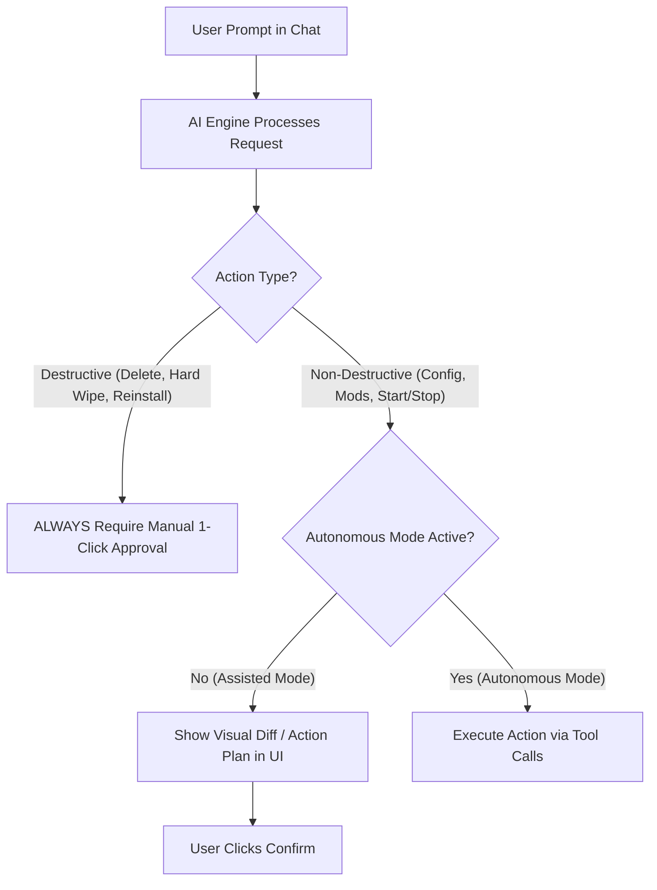

# MSM Intelligent Engine (AI Integration) — Architectural Planning & Specifications

> **Notice:** Confidential internal planning document for Maunting Server Manager (MSM).  
> **Target Version:** Next Major Update (`v4.0.0`)  
> **Status:** Draft / Conceptual Planning Phase  

---

## 1. Vision & Core Philosophy

MSM will evolve into an **intelligent, AI-assisted Server Management Platform**. Rather than a basic chatbot overlay, the AI operates as a deeply integrated, modular **Autonomous Operations & Diagnostics Assistant**.

### Key Principles
1. **Security & Privacy First (BYOK - Bring Your Own Key):**
   - Users provide their own API key via **OpenRouter** (covering 99%+ of LLM models), direct providers (OpenAI, Anthropic, Gemini), or local endpoints (Ollama / vLLM).
   - API keys are encrypted at rest via **DIS Shield (AES-256-GCM)**.
   - Keys are **never** logged, exposed in frontend states, or leaked in error stacktraces.
2. **Modular Architecture (`backend/services/ai_engine/`):**
   - Built as a clean, decoupled module parallel to the Guardian Engine.
   - Panel orchestrates tool execution using existing, authorized MSM backend APIs.
3. **Centralized Panel Orchestration (Multi-Node Isolation):**
   - The AI engine runs strictly within the **Central MSM Panel (Backend)**.
   - Node agents (`msm-agent` / Guardian Engine) remain lightweight and free of AI dependencies.
4. **Structured Tool Use / Function Calling (No Raw Shell Execution):**
   - LLMs must support Function Calling. The AI interacts exclusively through deterministic **Tools** (Create Server, Start/Stop, Edit Config, Install Mod, Read Logs).
5. **Mod Download Isolation & Anti-Malware Sandbox:**
   - External mod downloads (CurseForge, Modrinth, direct URLs) run in isolated rootless sandboxes before files are committed to server directories.
6. **Autonomy Guardrails & 2FA Activation:**
   - **Assisted Mode (Default):** AI prepares actions & visual diffs for 1-click human confirmation.
   - **Autonomous Mode (Opt-In):** AI executes non-destructive tasks automatically.
   - **2FA Security Barrier:** Activating Autonomous Mode requires a 2-step confirmation dialog + **TOTP 2FA Verification**.
   - **Hard Destructive Safeguard:** Destructive actions (**Server Delete**, **Hard Wipe**, **Blueprint Switch**, **Full Reinstall**) ALWAYS require manual 1-click human approval.

---

## 2. Modular Engine Component Architecture

```
backend/services/ai_engine/
├── __init__.py
├── engine.py           # Core AI Engine Orchestrator & Conversation Manager
├── provider_registry.py # Provider Adapters (OpenRouter, OpenAI, Anthropic, Gemini, Ollama)
├── tools.py            # Tool Definitions & Handlers (Server Ops, Files, Configs, Mods)
└── safety.py           # Log Scrubbing, Path Sanitization, Mod Download Sandbox
```

### Component Architecture Diagram
```
+-------------------------------------------------------------------+
|                        MSM Dashboard (UI)                         |
|   [ AI Assistant Drawer / Interactive Chat / Visual Diff Modal ]   |
+-------------------------------------------------------------------+
                                  | (HTTPS / WS)
                                  v
+-------------------------------------------------------------------+
|                    Central MSM Panel Backend                      |
|                                                                   |
|   +-----------------------+     +-----------------------------+   |
|   |  BYOK DIS Key Vault   |     |  AI Engine Orchestrator     |   |
|   |  (AES-256-GCM DIS)    |     |  (Provider & Tool Registry) |   |
|   +-----------------------+     +-----------------------------+   |
|                                                |                  |
+------------------------------------------------+------------------+
                                                 | (JWT API / gRPC)
                                                 v
                                  +-----------------------------+
                                  |    Guardian Node Agent      |
                                  |  (Isolated Mod Sandbox /    |
                                  |   Server Container Ops)     |
                                  +-----------------------------+
```

---

## 3. Provider Aggregation (OpenRouter + Direct BYOK)

To support 99%+ of LLM models globally without lock-in:

* **Primary Aggregator:** **OpenRouter API Adapter** (`openrouter.py`)
  * Enables access to GPT-4o, Claude 3.5 Sonnet, Llama 3, DeepSeek, Mistral, Gemini via a single unified API key.
* **Direct Providers:**
  * **OpenAI:** `gpt-4o`, `gpt-4o-mini`
  * **Anthropic:** `claude-3-5-sonnet`, `claude-3-haiku`
  * **Google Gemini:** `gemini-1.5-pro`, `gemini-2.0-flash`
  * **Local / Self-Hosted:** `Ollama`, `vLLM`, `LocalAI` (OpenAI-compatible `/v1/chat/completions` API)

---

## 4. Mod Sandbox & Isolation Security

Downloading mods from third-party platforms (Steam Workshop, CurseForge, Modrinth, arbitrary URLs) poses a security threat to the host node.

### Protection Workflow:
1. **Isolated Download Sandbox:** Mods are downloaded into a temporary, isolated rootless sandbox container (`msm-mod-sandbox`).
2. **Static & Extension Inspection:** Sandbox validates file extensions (`.jar`, `.zip`, `.pak`, `.vpk`), verifies MIME types, and checks SHA256 checksums against known registries.
3. **Controlled Transfer:** Only validated mod files are copied into the target gameserver's `Mods/` directory.

---

## 5. Autonomy Modes, Safeguards & 2FA Barrier



### Autonomous Mode Activation Flow
To turn on Autonomous Mode:
1. **Step 1:** Click "Enable Autonomous Mode" in AI Settings.
2. **Step 2:** Modal 1: *"Are you sure?"* confirmation.
3. **Step 3:** Modal 2: Detailed explanation of risks and autonomous execution boundaries.
4. **Step 4:** **2FA Verification:** Prompt for TOTP 2FA code (if 2FA is active on the account).

---

## 6. Defined LLM Tool Set (`backend/services/ai_engine/tools.py`)

| Category | Tool Name | Parameters | Description |
| :--- | :--- | :--- | :--- |
| **Server Lifecycle** | `create_server` | `name`, `blueprint_id`, `node_id`, `ram_mb`, `cpu_cores`, `ports` | Creates a new gameserver with specified resource limits. |
| **Server Lifecycle** | `control_server` | `server_id`, `action (start/stop/restart)` | Sends power commands to gameserver. |
| **Interactive Questionnaire** | `ask_user_clarification` | `question`, `options`, `missing_fields` | Prompts user in chat when parameters are missing. |
| **Log Diagnostics** | `get_server_logs` | `server_id`, `lines` | Fetches scrubbed log buffer from Guardian Engine. |
| **Configuration** | `read_server_config` | `server_id`, `relative_path` | Reads and parses INI, JSON, TOML, or YAML configs. |
| **Configuration** | `propose_config_patch` | `server_id`, `relative_path`, `content` | Generates a unified diff for config tuning. |
| **Mod Management** | `search_and_install_mod` | `server_id`, `mod_name`, `provider` | Downloads & validates mod via isolated sandbox. |
| **Capacity & Sizing** | `analyze_node_capacity` | `server_id` | Checks node CPU/RAM usage and suggests sizing. |

---

## 7. Development Roadmap & Phases

- [ ] **Phase 1: BYOK Provider Registry & DIS Storage**
  - Implement Provider Adapters (OpenRouter, OpenAI, Anthropic, Gemini, Ollama).
  - DIS-Sidecar key encryption & log scrubbing middleware.
- [ ] **Phase 2: Modular AI Engine & Tool Definitions**
  - Create `backend/services/ai_engine/` modular structure.
  - Implement Function Calling Tools for Server Ops, Configs, Logs & Blueprints.
- [ ] **Phase 3: Interactive Chat UI & Clarification Flow**
  - Build Dashboard Chat Drawer with interactive questionnaire support.
- [ ] **Phase 4: Mod Download Isolation Sandbox & Blueprint Adapters**
  - Implement `msm-mod-sandbox` container isolation for safe mod downloads.
  - Add Steam Workshop, CurseForge, and Modrinth mod adapters.
- [ ] **Phase 5: Autonomy Modes & 2FA Activation Barrier**
  - Implement 2-step activation modal + TOTP 2FA verification for Autonomous Mode.
  - Enforce non-bypassable manual approval for destructive actions.
