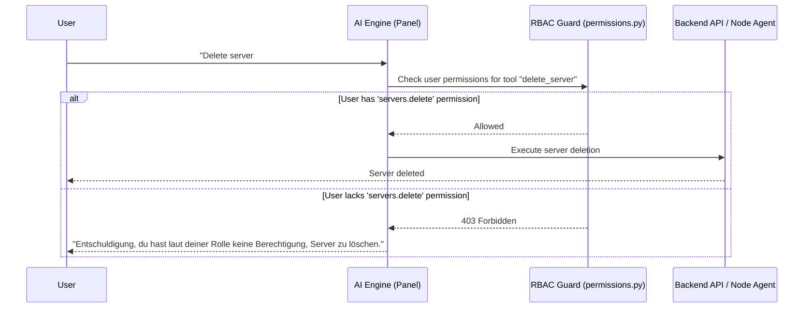
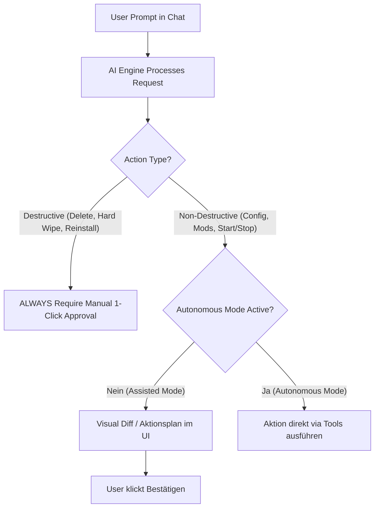

# MSM Intelligent Engine (AI Integration) — Architectural Planning & Specifications

> **Notice:** Confidential internal planning document for Maunting Server Manager (MSM).  
> **Target Version:** Next Major Update (`v4.0.0`)  
> **Status:** Draft / Conceptual Planning Phase  

---

## 1. Vision & Core Philosophy

MSM will evolve into an **intelligent, AI-assisted Server Management Platform**. Rather than a basic chatbot overlay, the AI operates as a deeply integrated, modular **Autonomous Operations & Diagnostics Assistant** (inspired by advanced autonomous agent architectures like OpenClaw & Hermes Agent).

### Key Principles
1. **Security & Privacy First (BYOK - Bring Your Own Key):**
   - Users provide their own API key via **OpenRouter** (covering 99%+ of LLM models), direct providers (OpenAI, Anthropic, Gemini), or local endpoints (Ollama / vLLM).
   - API keys are encrypted at rest via **DIS Shield (AES-256-GCM)**.
   - Keys are **never** logged, exposed in frontend states, or leaked in error stacktraces.
2. **Strict RBAC & Permission Enforcement:**
   - The AI Assistant is strictly bounded by MSM's Role-Based Access Control (RBAC).
   - Tool calls inherit the exact permissions of the logged-in user. If a user lacks `servers.delete` or `configs.edit`, the backend API blocks the action, and the AI responds gracefully about missing rights.
3. **Modular Architecture (`backend/services/ai_engine/`):**
   - Decoupled module parallel to Guardian Engine.
   - Panel orchestrates tool execution using existing, authorized MSM backend APIs.
4. **Steam Workshop & Native Mod Visibility:**
   - Integrates with MSM's native Steam Workshop engine (Steam Web API / SteamCMD).
   - Displays a dedicated **Visual Mod Status View** (active, subscribed, pending update, disabled mods) in the UI.
5. **Continuous Skill Acquisition & Long-Term Memory (Hermes / OpenClaw Style):**
   - **Skill Builder:** The AI creates, persists, and refines procedural "Skills" (reusable runbooks for complex game setups or troubleshooting).
   - **Preference Memory:** Remembers user preferences across sessions (e.g. preferred node, standard RAM allocations, favorite mod packs).
6. **Mod Download Isolation & Anti-Malware Sandbox:**
   - External mod downloads (CurseForge, Modrinth, direct URLs) run in isolated rootless sandboxes before files are committed to server directories.
7. **Autonomy Guardrails & 2FA Activation:**
   - **Assisted Mode (Default):** AI prepares actions & visual diffs for 1-click human confirmation.
   - **Autonomous Mode (Opt-In):** AI executes non-destructive tasks automatically.
   - **2FA Security Barrier:** Activating Autonomous Mode requires a 2-step confirmation dialog + **TOTP 2FA Verification**.
   - **Hard Destructive Safeguard:** Destructive actions (**Server Delete**, **Hard Wipe**, **Blueprint Switch**, **Full Reinstall**) ALWAYS require manual 1-click human approval.

---

## 2. Modular Engine Architecture (`backend/services/ai_engine/`)

```
backend/services/ai_engine/
├── __init__.py
├── engine.py            # Core AI Engine Orchestrator & Conversation Manager
├── provider_registry.py  # Provider Adapters (OpenRouter, OpenAI, Anthropic, Gemini, Ollama)
├── rbac_guard.py        # RBAC Context Binding & Permission Validation
├── memory_store.py      # Long-Term Preference & Entity Memory (DIS Encrypted / DB)
├── skill_registry.py    # Dynamic Skill Building & Procedural Knowledge Engine
├── persona_config.py    # Customizable System Prompt & Assistant Name Manager
├── tools.py             # Tool Definitions & Handlers (Server Ops, Files, Configs, Steam Workshop)
└── safety.py            # Log Scrubbing, Path Sanitization, Mod Download Sandbox
```

### System Component Overview
```
+-------------------------------------------------------------------+
|                        MSM Dashboard (UI)                         |
|   [ AI Assistant Drawer / Steam Mod Status View / Diff Modal ]   |
+-------------------------------------------------------------------+
                                  | (HTTPS / WS)
                                  v
+-------------------------------------------------------------------+
|                    Central MSM Panel Backend                      |
|                                                                   |
|   +-----------------------+     +-----------------------------+   |
|   |  BYOK DIS Key Vault   |     |  AI Engine Orchestrator     |   |
|   |  (AES-256-GCM DIS)    |     |  (Provider & Tool Registry) |   |
|   +-----------------------+     +-----------------------------+   |
|               |                                |                  |
|               v                                v                  |
|   +-----------------------+     +-----------------------------+   |
|   |  RBAC Permission Guard|     |  Skill & Memory Store       |   |
|   |  (User Role Enforcement)|   |  (Continuous Learning)      |   |
|   +-----------------------+     +-----------------------------+   |
|                                                |                  |
+------------------------------------------------+------------------+
                                                 | (JWT API / gRPC)
                                                 v
                                  +-----------------------------+
                                  |    Guardian Node Agent      |
                                  |  (Isolated Mod Sandbox /    |
                                  |   SteamCMD & Container Ops) |
                                  +-----------------------------+
```

---

## 3. Onboarding Setup Wizard & Customizable Persona

When the AI Assistant module is first enabled in MSM Settings, an Onboarding Wizard guides the admin:

1. **Assistant Identity:** Name the assistant (e.g. *"MSM Copilot"*, *"Guardian AI"*).
2. **Persona & System Prompt:** Customize system prompt instructions, tone, and operational guidelines.
3. **BYOK Provider Connection:** Configure OpenRouter API key or direct provider endpoint (OpenAI, Anthropic, Gemini, Ollama).
4. **Memory & Autonomy Rules:** Define initial preference memory and autonomy levels.

---

## 4. Provider Aggregation (OpenRouter + Direct BYOK)

To support 99%+ of LLM models globally:
* **Primary Aggregator:** **OpenRouter API Adapter** (`openrouter.py`)
  * Single key access to GPT-4o, Claude 3.5 Sonnet, Llama 3, DeepSeek, Mistral, Gemini.
* **Direct Providers:**
  * **OpenAI:** `gpt-4o`, `gpt-4o-mini`
  * **Anthropic:** `claude-3-5-sonnet`, `claude-3-haiku`
  * **Google Gemini:** `gemini-1.5-pro`, `gemini-2.0-flash`
  * **Local / Self-Hosted:** `Ollama`, `vLLM`, `LocalAI` (OpenAI-compatible API)

---

## 5. Steam Workshop & Native Mod Visibility

For Steam-based games (DayZ, Conan Exiles, ARK, Scum, Project Zomboid):
* **Native Steam API Bridge:** The AI calls `backend/services/steam_service.py` to search Steam Workshop IDs, check subscriber counts, and verify dependencies.
* **UI Mod Status Visualizer:** A dedicated UI tab in the server view displays:
  * **Active Mods:** Currently loaded in server startup parameters.
  * **Subscribed Mods:** Downloaded on the Node via SteamCMD.
  * **Pending Updates:** Mods out of date relative to Steam Workshop build IDs.
  * **Disabled / Incompatible Mods:** Quarantined or disabled mod files.

---

## 6. RBAC & Permission Enforcement



---

## 7. Memory & Dynamic Skill Building (Hermes / OpenClaw Architecture)

### A. Long-Term Preference Memory (`memory_store.py`)
* Stores user-defined preferences and environment context in the database:
  * *"User prefers Paper-Spigot for Minecraft servers."*
  * *"Node 2 is designated for heavy EU production games."*
  * *"Standard DayZ server RAM allocation is 8192 MB."*

### B. Procedural Skill Acquisition (`skill_registry.py`)
* As the AI solves complex setup issues or configures specific game server stacks, it encapsulates the solution into a **Reusable Skill (Runbook)**.
* Skills are stored as structured JSON/Markdown runbooks and dynamically retrieved when similar tasks are requested in the future.

---

## 8. Mod Download Sandbox & Anti-Malware Protection

1. **Isolated Download Sandbox:** Third-party mods (CurseForge, Modrinth, direct URLs) are fetched inside `msm-mod-sandbox` rootless containers.
2. **Static & Extension Inspection:** Validates extensions (`.jar`, `.zip`, `.pak`, `.vpk`), verifies MIME types, and checks SHA256 checksums.
3. **Controlled Transfer:** Only approved, clean mod files are copied into the target gameserver's `Mods/` directory.

---

## 9. Autonomy Modes, Safeguards & 2FA Barrier



### Autonomous Mode Activation Flow
To activate Autonomous Mode:
1. **Step 1:** Click "Enable Autonomous Mode" in AI Settings.
2. **Step 2:** Modal 1: *"Are you sure?"* confirmation.
3. **Step 3:** Modal 2: Detailed explanation of risks and autonomous execution boundaries.
4. **Step 4:** **2FA Verification:** Prompt for TOTP 2FA code (if 2FA is active on the account).

---

## 10. Defined LLM Tool Set (`backend/services/ai_engine/tools.py`)

| Category | Tool Name | Parameters | Description |
| :--- | :--- | :--- | :--- |
| **Server Lifecycle** | `create_server` | `name`, `blueprint_id`, `node_id`, `ram_mb`, `cpu_cores`, `ports` | Creates a new gameserver with specified resource limits. |
| **Server Lifecycle** | `control_server` | `server_id`, `action (start/stop/restart)` | Sends power commands to gameserver. |
| **Interactive Questionnaire** | `ask_user_clarification` | `question`, `options`, `missing_fields` | Prompts user in chat when parameters are missing. |
| **Log Diagnostics** | `get_server_logs` | `server_id`, `lines` | Fetches scrubbed log buffer from Guardian Engine. |
| **Configuration** | `read_server_config` | `server_id`, `relative_path` | Reads and parses INI, JSON, TOML, or YAML configs. |
| **Configuration** | `propose_config_patch` | `server_id`, `relative_path`, `content` | Generates a unified diff for config tuning. |
| **Steam Workshop** | `manage_workshop_mod` | `server_id`, `workshop_id`, `action (subscribe/unsubscribe/update)` | Manages Steam Workshop mod lifecycle. |
| **Mod Sandbox** | `search_and_install_mod` | `server_id`, `mod_name`, `provider` | Downloads & validates mod via isolated sandbox. |
| **Capacity & Sizing** | `analyze_node_capacity` | `server_id` | Checks node CPU/RAM usage and suggests sizing. |

---

## 11. Development Roadmap & Phases

- [ ] **Phase 1: BYOK Provider Registry, DIS Storage & Onboarding Wizard**
  - OpenRouter, OpenAI, Anthropic, Gemini & Ollama provider adapters.
  - Setup Wizard for Assistant Identity, Persona & System Prompt customization.
- [ ] **Phase 2: Modular Engine, RBAC Guard & LLM Tools**
  - Implement `backend/services/ai_engine/` modular structure & RBAC binding.
  - Create Function Calling Tools for Server Ops, Configs, Logs & Steam Workshop.
- [ ] **Phase 3: Interactive Chat UI & Steam Mod Status Visualizer**
  - Build Dashboard Chat Drawer with interactive questionnaire support.
  - Create UI View for active, subscribed, pending & disabled Steam Workshop mods.
- [ ] **Phase 4: Memory Engine & Dynamic Skill Building (Hermes Style)**
  - Implement `memory_store.py` for user preferences.
  - Implement `skill_registry.py` for dynamic skill acquisition and runbook persistence.
- [ ] **Phase 5: Mod Download Sandbox & 2FA Autonomy Barrier**
  - Implement `msm-mod-sandbox` container isolation for third-party mod downloads.
  - Implement 2-step activation modal + TOTP 2FA verification for Autonomous Mode.
  - Enforce non-bypassable manual approval for destructive actions.
