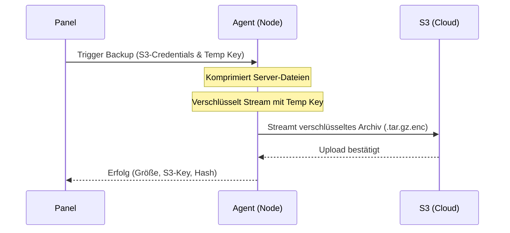

# Phase 6: Backup-System für Multi-Node optimieren

Dieses Dokument beschreibt die abschließende Optimierung des Backup-Systems. Ziel ist es, den Datenfluss bei großen Backups (mehrere Gigabyte) zu dezentralisieren, sodass die Daten direkt vom Node zu S3 fließen, ohne das Panel zu belasten.

---

## 1. Dezentraler S3-Upload & Download

In Phase 2 wurden Backups zur Wahrung der Einfachheit (KISS) noch durch das Panel geleitet. Für den produktiven Betrieb wird dies nun optimiert:

---

## 2. API-Erweiterungen & Datenfluss

### 2.1 Backup erstellen (`POST /backup/create` auf dem Agenten)
Das Panel sendet folgende Daten im Request:
- `server_id`: Welcher Server gesichert werden soll.
- `s3_config`: S3 Bucket, Endpoint, Access Key, Secret Key (temporär in-memory übergeben).
- `encryption_key`: Ein temporär vom Panel für dieses Backup erzeugter symmetrischer Schlüssel.

**Ablauf auf dem Agenten**:
1. Der Agent komprimiert das Server-Verzeichnis lokal zu einem `.tar.gz` (bzw. streamt die Dateien direkt in den Packer).
2. Der Agent verschlüsselt den Datenstrom mit dem übergebenen `encryption_key` (AES-256-GCM analog zur DIS-Streaming-Spezifikation).
3. Der Agent lädt diesen verschlüsselten Datenstrom direkt zu S3 hoch (Multipart-Upload).
4. Der lokale Speicherplatz wird sofort bereinigt.
5. Der Agent meldet den Erfolg mit Metadaten (Dateigröße, S3-Pfad) an das Panel zurück.

### 2.2 Backup wiederherstellen (`POST /backup/restore` auf dem Agenten)
Das Panel sendet:
- `server_id`: Ziel-Server.
- `s3_config`: S3 Zugangsdaten.
- `s3_key`: Pfad zum Backup-Archiv im Bucket.
- `encryption_key`: Der zur Entschlüsselung benötigte Schlüssel.

**Ablauf auf dem Agenten**:
1. Der Agent lädt den verschlüsselten Datenstrom von S3 herunter.
2. Der Agent entschlüsselt den Datenstrom on-the-fly.
3. Der Agent entpackt die Dateien direkt in das Zielverzeichnis des Servers.

---

## 3. Sicherheits-Invarianten

- **Keine dauerhafte Speicherung von S3-Keys**: Der Agent speichert zu keinem Zeitpunkt S3-Credentials oder Backup-Schlüssel auf der Festplatte. Sie liegen ausschließlich während der Dauer der Backup-/Restore-Transaktion im RAM.
- **Kryptographische Kompatibilität**: Die Verschlüsselungsmethode im Python-Agenten muss exakt kompatibel mit der Entschlüsselungsmethode des DIS-Sidecars sein (AES-256-GCM, gleiche Header-Struktur für Nonce und Auth-Tag). Dies stellt sicher, dass Backups bei Bedarf auch manuell oder über das Panel wiederhergestellt werden können.

---

## 4. Test- und Verifizierungsschritte

1. **S3 Konnektivität**:
   - Konfiguriere einen S3-Test-Bucket (z.B. MinIO lokal oder AWS S3).
2. **Backup/Restore E2E-Test**:
   - Stoße ein Backup an und prüfe, ob die Datei im S3-Bucket landet.
   - Verifiziere, dass die Datei im S3-Bucket verschlüsselt ist (lade sie manuell herunter und versuche sie zu entpacken -> muss fehlschlagen).
   - Führe einen Restore durch und prüfe, ob alle Spieldaten korrekt und unbeschädigt wiederhergestellt wurden.
